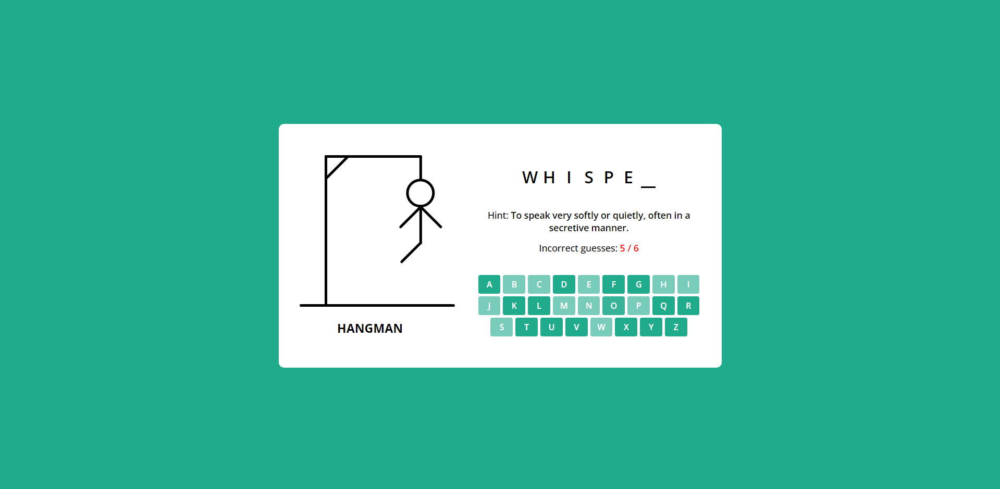

# Hangman

Hangman is a very popular word-guessing game that can be played on anything, whether it's on a whiteboard, paper and pencil, or even on an electronic device. This version of Hangman can be played in your browser with 37 words to choose from. It can also save your current score to your browser's local storage. Every time a new word is generated, it is removed from a copy of the word list. When the copy of the word list is empty, it is replenished with the same 37 words. This is to guarantee that you will never get the same word twice in a row. A copy of this word list is also saved in local storage. This version of Hangman can be viewed on any screen size up to the smallest smartphones, such as the size of the iPhone SE.

## Features

- **Score Tracking**: The score is increased by 100 every time the word is guessed correctly. If the user guesses 6 letters incorrectly, the score will reset to 0 and a new word will be generated. The score is also saved in local storage.
- **Responsive Design**: The game can be viewed on most screen sizes.
- **Random Word Selection**: The game will randomly select a word from the list of 37 words and hints. Each time a new word is generated, it will be subtracted from that list of words until there are no words in the list. When that happens, the word list will be replenished with the same 37 words.
- **Game Over Screen**: A modal will pop up every time the game ends. If the user guesses the word correctly while having under 6 incorrect guesses, a smiley face will be displayed, and the user's score will be displayed. If the user guesses the word incorrectly, a sad face will be displayed, and the chosen word will be revealed.
- **Keyboard Support**: The user can use the keyboard to enter their guesses. Pressing the "Enter" key will close the modal and generate a new word.

## Core Files

- `index.html`: This contains the HTML components for the game, including the current state of the Hangman, the game's title, the display of the chosen word, the number of incorrect guesses, the letters to be guessed, and the modal that pops up when the game ends.
- `style.css`: The styles for the HTML components as well as media queries for responsiveness are stored here.
- `word-list.js`: This contains the list of words and hints to be used in the game. Feel free to add to it.
- `script.js`: This contains the JavaScript code for the game's functionality.
- `icon.png`: An image of the Hangman game's icon.

## How to Run

1. Download the files from this repository.
2. Open `index.html` in your browser.
3. Play the game!

## Credits

This project was inspired by the <a href="https://www.youtube.com/watch?v=hSSdc8vKP1I" target="_blank">Build A Hangman Game</a> tutorial from CodingNepal on Youtube. Score tracking, keyboard support, local storage use, and unique word generation were added independently.